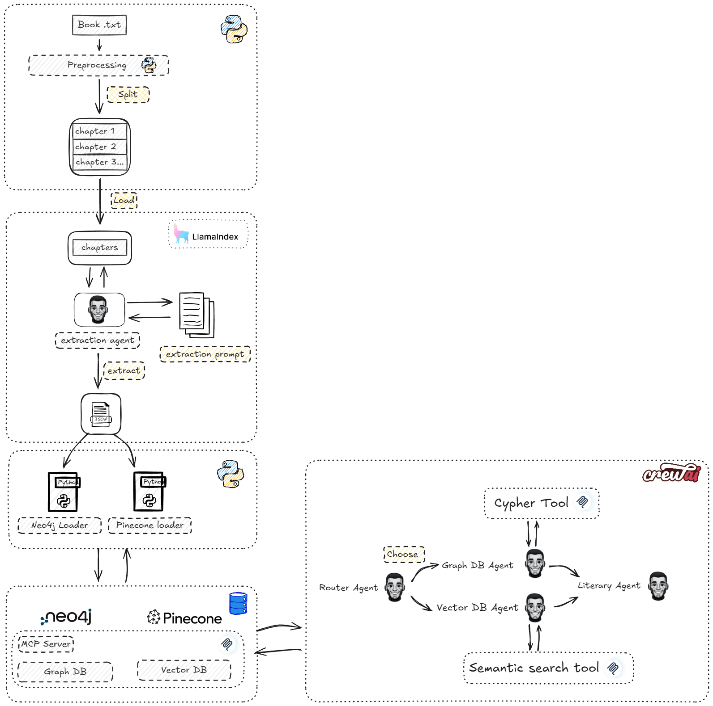
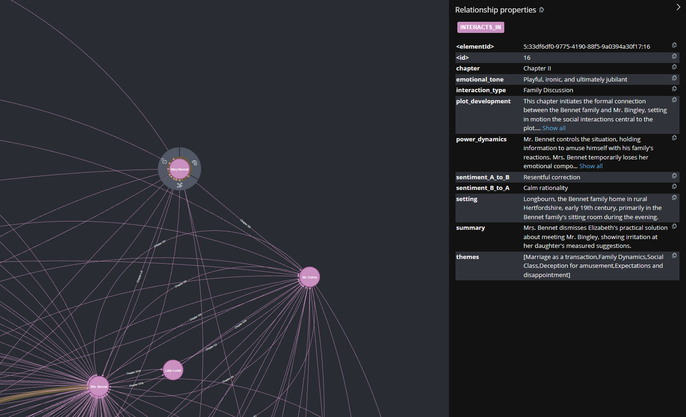
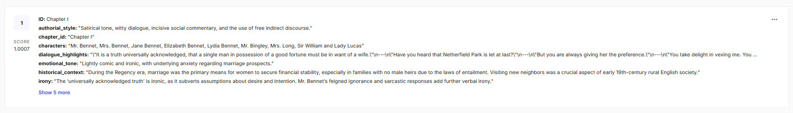

# Pride and Prejudice Graph RAG (Neo4j + Pinecone + CrewAI + MCP)

This project implements a Graph RAG pipeline over **“Pride and Prejudice”**, combining:

- **Neo4j** for modeling character relationships.
- **Pinecone** for semantic search over scene summaries.
- **MCP (Model Context Protocol)** to expose these data sources as tools.
- **CrewAI** to orchestrate multiple specialized agents (graph, semantic, routing, answer).

My goal with this repository is to showcase **AI Data Engineering** skills:
data ingestion, graph modeling, vector indexing, and LLM integration via MCP.

---


## Architecture – Overview

1. **Book ingestion and processing**
   - Pre-processing of the “Pride and Prejudice” text.
   - Extraction of:
     - scenes,
     - characters per scene,
     - pairwise relationships,
     - rich metadata (emotions, themes, power dynamics, etc.).

2. **Graph Store (Neo4j)**
   - Script: `src/graph_db_loader.py`
   - Structure:
     - Nodes: `(:Character {name, description, roles[...]})`
     - Relationships:  
       `(:Character)-[:INTERACTS_IN {chapter, setting, interaction_type, sentiment_A_to_B, sentiment_B_to_A, emotional_tone, power_dynamics, themes, plot_development, summary}]->(:Character)`
   - Focus: **relational structure** — who interacts with whom, where, how, and with what impact on the plot.
    
3. **Vector Store (Pinecone)**
   - Script: `src/vector_db_loader.py`
   - Each scene becomes a vector from `interaction_summary`, with metadata:
     - `chapter_id`, `setting`, `themes`, `characters`, `emotional_tone`,
     - `power_dynamics`, `plot_development`, `relationship_development`,
     - `authorial_style`, `historical_context`, `irony`, `dialogue_highlights`.
   - Focus: **rich narrative context** — tone, style, specific moments, and key dialogue.

    

4. **MCP Server**
   - File: `src/app_crewai/tools/mcp_server.py`
   - Exposes MCP tools:
     - `run_cypher(body: CypherRequest)` → Neo4j (graph queries).
     - `semantic_pinecone_search(body: SemanticSearchRequest)` → Pinecone (semantic scenes).
   - Runs over `stdio` and is consumed by the app via `MCPServerAdapter`.

5. **Orchestration via CrewAI**
   - Files:
     - `src/app_crewai/config/agents.yaml`
     - `src/app_crewai/config/tasks.yaml`
     - `src/app_crewai/crew.py`
   - The crew is built dynamically from YAML; agents and tasks are not hard-coded.

---

## Agent Architecture

The application uses a multi-agent architecture with intelligent routing:

- `router_agent` – **Question Router**
  - Classifies each user question into one of:
    - `graph_only`
    - `semantic_only`
    - `graph_and_semantic`
    - `direct_answer`
  - Decides when to use Neo4j, Pinecone, both, or none (to reduce cost).

- `graph_agent` – **Neo4j Relationship Specialist**
  - Uses only the MCP tool `run_cypher`.
  - Handles questions about:
    - who interacts with whom,
    - relationship types,
    - relationship evolution,
    - impact on plot and social dynamics.

- `semantic_agent` – **Semantic Scene Retrieval Specialist**
  - Uses only the MCP tool `semantic_pinecone_search`.
  - Retrieves relevant scenes (summary + metadata) for:
    - narrative context,
    - emotional tone,
    - authorial style,
    - specific moments and dialogue.

- `literary_agent` – **Orchestrator and Literary Analyst**
  - Never calls tools directly.
  - Reads the router decision + graph/semantic outputs and writes the final answer in 2–4 paragraphs.

Configuration lives in:

- `src/app_crewai/config/agents.yaml`
- `src/app_crewai/config/tasks.yaml`

`src/app_crewai/crew.py` is responsible for:

- loading agents and tasks from YAML,
- binding `task -> agent` based on YAML config,
- attaching MCP tools automatically for tasks that use Neo4j or Pinecone,
- building the `Crew` and running `kickoff`.

---

## How to Run

### 1. Prerequisites

- Python 3.12+
- Docker (recommended for Neo4j)
- Accounts and API keys for:
  - Neo4j (or a local instance),
  - Pinecone,
  - OpenAI (or compatible LLM provider, via `OPENAI_MODEL`),
  - Gemini (for embeddings, if keeping the current setup).

### 2. Environment Variables
Create a `.env` file, for example:

```env
OPENAI_API_KEY=...
OPENAI_MODEL=gpt-4o-mini

NEO4J_URI=bolt://neo4j:7687
NEO4J_USER=neo4j
NEO4J_PASSWORD=...

PINECONE_API_KEY=...
PINECONE_INDEX_NAME=pride-prejudice-scenes

GEMINI_API_KEY=...

LLAMA_EXTRACT_KEY=...
```

### 3. Start Neo4j and load the graph
With Docker Compose, for example:

bash

docker-compose up neo4j
Then populate Neo4j:

bash

python src/graph_db_loader.py

### 4. Populate Pinecone

bash

python src/vector_db_loader.py
This creates the index (if needed) and upserts scene vectors.

### 5. Run the interactive app

bash

python src/main.py
You should see:

text

Type your question about Pride and prejudice:

Example questions:

“How does Elizabeth Bennet's relationship with Mr. Darcy evolve over the novel?”
“In which scenes does Lady Catherine influence the power dynamics between characters?”
“Show key scenes where irony is used to criticize social norms.”

---

### What This Showcases
- Graph Modeling (Neo4j)

  - Design of Character nodes and INTERACTS_IN relationships with rich properties.
  - Idempotent loading with constraints and MERGE operations (graph_db_loader.py).

- Vector Store Design (Pinecone)
  - Thoughtful separation of text vs. metadata fields.
  - Batched embedding and upsert workflow using Gemini (vector_db_loader.py).

- LLM Integration via MCP
  - Exposing Neo4j and Pinecone as reusable MCP tools.
  - Communication over stdio using FastMCP and MCPServerAdapter.

- Multi-agent Orchestration (CrewAI)
  - Architecture with a router agent, data specialists, and a synthesis agent.
  - Declarative configuration (YAML) and dynamic binding in the crew runtime.

- Data Engineering Practices
  - Clear separation between data layer (Neo4j/Pinecone), MCP layer, and orchestration layer.
  - Docker friendliness and configuration via .env.

### Future Work

- Add unit tests for data loading and MCP server behavior.
- Add basic observability (structured logging for Neo4j/Pinecone queries).
- Generalize the template to other books or domains, documenting the customization points.

Feel free to open issues or PRs if you’d like to adapt this template to a different domain or extend the architecture.